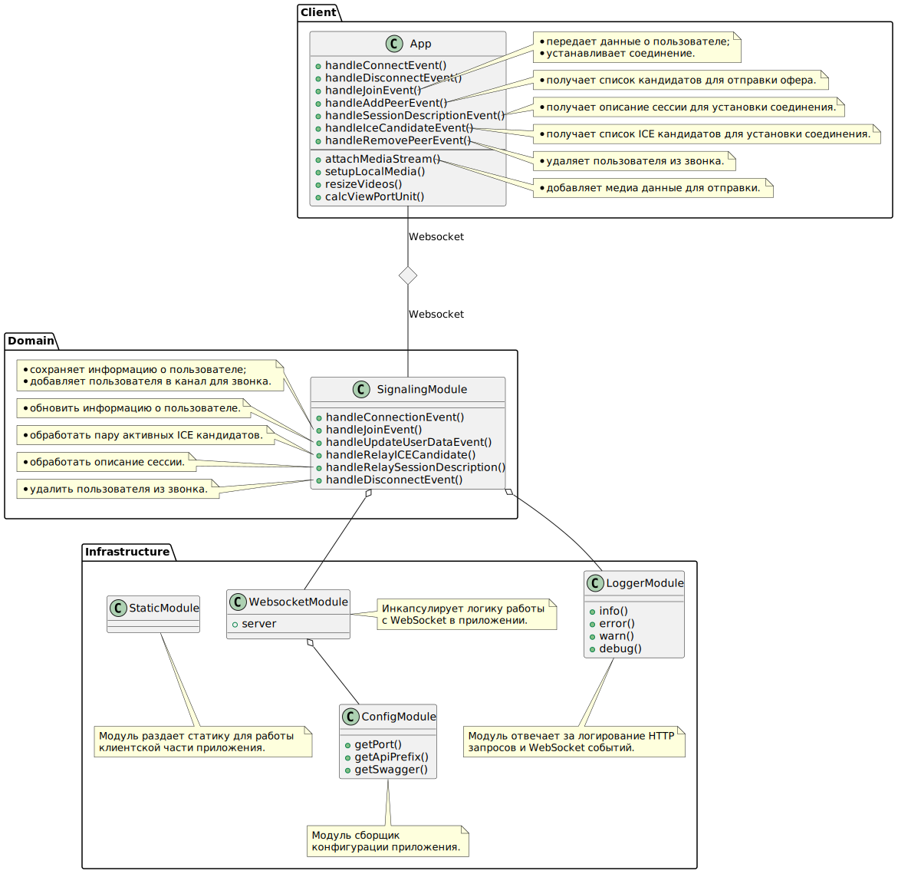

# Приложение для передачи медиа данных с помощью технологии WebRTC

<div>
  <a>
    
  </a>
</div>

## Описание

Приложение реализует интерфейс сигнального сервера для установки peer-to-peer соединения с помощью протокола WebRTC в браузере.

## Основные файлы

### Код

- [/client/www/script.js](./client/www/script.js) - клиентский код коммуникации с сигнальным сервером и установки WebRTC соединения
- [/src/domain/webrtc/signaling/signaling.gateway.ts](./src/domain/webrtc/signaling/signaling.gateway.ts) - код сигнального сервера для обмена сессиями и ICE кандидатами

### Документация 

- [/docs/presentation/Запись_экрана_2023-01-16_в_18-01-49.mp4](./docs/presentation/Запись_экрана_2023-01-16_в_18-01-49.mp4) - запись работы приложения (запуск и создание звонка в браузере)

<video width="640" height="480" controls muted>
  <source src="docs/presentation/Запись_экрана_2023-01-16_в_18-01-49.mp4" type="video/mp4">
</video>

## Источник

Алгоритм сигнального сервера и клиета взят из репозитория [tlk](https://github.com/vasanthv/tlk).

Проблемы источника:

- Клиент использует vue.js и socket.io из глобальных переменных;
- Сигнальный сервер использует глобальные переменные для группировки пиров по каналам;
- Слабая типизация сигнального сервера и полное отсутствие типизации клиентаю

## Установка

```bash
$ yarn install
```

## Запуск

```bash
$ yarn copy:envs
$ yarn build
$ yarn start
```

## Разработка

```bash
$ yarn copy:envs
$ yarn start:dev
```

## Диаграммы

<details>
  <summary><strong>Диаграмма алгоритмов</strong></summary>

```uml
@startuml

skinparam maxMessageSize 200

participant ClientA
participant ClientB
participant SignalingServer
participant STUN

ClientA -> ClientA : Запросить стрим с медиа данными\n**navigator.getUserMedia**
ClientA -> ClientA : Перенаправить стрим в <video /> элемент\n**video.srcObject = stream**
ClientA -> SignalingServer : Запросить список участников беседы\n**socket.emit(join, ...)
SignalingServer -> SignalingServer : Добавить нового участника беседы
SignalingServer -> ClientB : Уведомить о новом участнике беседы\n**socket.emit(addPeer, ...)
ClientB -> ClientB : Создать новый инстанс RTCPeerConection
ClientB -> ClientB : Добавить RTCPeerConection к списку участников беседы
ClientB -> ClientB : Добавить локальный стрим в RTCPeerConection\n**connection.addSream()
ClientB -> ClientB : Добавить вывод полученного стрим в <video />\n**connection.onaddstream
ClientB -> ClientB : Добавить сериализацию данных из чата\n**connection.ondatachannel,event.channel.onmessage**
SignalingServer -> ClientA : Отправить список участников беседы
ClientA -> ClientA : Создать офер и описание сессии\n**connection.createOffer()
ClientA -> ClientA : Добавить локальное описание сессии\n**connection.setLocalDescription
ClientA -> ClientA : Добавить локальный стрим в RTCPeerConection\n**connection.addSream()
ClientA -> ClientA : Добавить вывод полученного стрим в <video />\n**connection.onaddstream
ClientA -> ClientA : Добавить сериализацию данных из чата\n**connection.ondatachannel,event.channel.onmessage**
ClientA -> SignalingServer : Отправить описание сессии участникам беседы\n**socket.emit(relaySessionDescription, ...)
SignalingServer -> ClientB : Уведомить о новом описании сессии\n**socket.emit(sessionDescription)
ClientB -> ClientB : Создать новый инстанc RTCSessionDescription
ClientB -> ClientB : Добавить описание сессии в список удаленных сессий\n**peer.setRemoteDescription**
ClientB -> ClientB : Создать ответ\n**peer.createAnswer**
ClientB -> ClientB : Добавить локальное описание из createAnswer\n**peer.setLocalDescription**
ClientB -> SignalingServer : Отправить описание сессии участникам беседы\n**socket.emit(relaySessionDescription)
SignalingServer -> ClientA : Уведомить об ответе\n**socket.emit(sessionDescription)
ClientA -> ClientA : Создать новый инстанc RTCSessionDescription
ClientA -> ClientA : Добавить описание сессии в список удаленных сессий\n**peer.setRemoteDescription**
ClientA -> STUN : Запросить ICE кандидатов
STUN --> ClientA : Отдать список ICE кандидатов
ClientA -> SignalingServer : Уведомить сигнальный сервер о новом ICE кандидате\n**socket.emit(relayICECandidate)
SignalingServer -> ClientB : Уведомить клиента о новом ICE кандидате
ClientB -> ClientB : Добавить ICE кандидата к подключению\n**peer.addIceCandidate()

ClientB -> STUN : Запросить ICE кандидатов
STUN --> ClientB : Отдать список ICE кандидатов
ClientB -> SignalingServer : Уведомить сигнальный сервер о новом ICE кандидате\n**socket.emit(relayICECandidate)
SignalingServer -> ClientA : Уведомить клиента о новом ICE кандидате
ClientA -> ClientA : Добавить ICE кандидата к подключению\n**peer.addIceCandidate()

@enduml
```

</details>

<br />


<br />

<details>
  <summary><strong>Диаграмма классов</strong></summary>

```uml
@startuml
package Client {
  class App {
    +handleConnectEvent()
    +handleDisconnectEvent()
    +handleJoinEvent()
    +handleAddPeerEvent()
    +handleSessionDescriptionEvent()
    +handleIceCandidateEvent()
    +handleRemovePeerEvent()
    ---
    +attachMediaStream()
    +setupLocalMedia()
    +resizeVideos()
    +calcViewPortUnit()
  }

  note right of App::handleJoinEvent
  * передает данные о пользователе;
  * устанавливает соединение.
  end note

  note right of App::handleAddPeerEvent
  * получает список кандидатов для отправки офера.
  end note

  note right of App::handleSessionDescriptionEvent
  * получает описание сессии для установки соединения.
  end note

  note right of App::handleIceCandidateEvent
  * получает список ICE кандидатов для установки соединения.
  end note

  note right of App::handleRemovePeerEvent
  * удаляет пользователя из звонка.
  end note

  note right of App::attachMediaStream
  * добавляет медиа данные для отправки.
  end note
}

package Domain {
  class SignalingModule {
    +handleConnectionEvent()
    +handleJoinEvent()
    +handleUpdateUserDataEvent()
    +handleRelayICECandidate()
    +handleRelaySessionDescription()
    +handleDisconnectEvent()
  }

  note left of SignalingModule::handleJoinEvent
  * cохраняет информацию о пользователе;
  * добавляет пользователя в канал для звонка.
  end note

  note left of SignalingModule::handleUpdateUserDataEvent
  * обновить информацию о пользователе.
  end note

  note left of SignalingModule::handleRelayICECandidate
  * обработать пару активных ICE кандидатов.
  end note

  note left of SignalingModule::handleRelaySessionDescription
  * обработать описание сессии.
  end note

  note left of SignalingModule::handleDisconnectEvent
  * удалить пользователя из звонка.
  end note
}

package Infrastructure {
  class LoggerModule {
    +info()
    +error()
    +warn()
    +debug()
  }

  class WebsocketModule {
    +server
  }

  class ConfigModule {
    +getPort()
    +getApiPrefix()
    +getSwagger()
  }

  class StaticModule {
  }

  note bottom of LoggerModule
  Модуль отвечает за логирование HTTP
  запросов и WebSocket событий.
  end note

  note bottom of ConfigModule
  Модуль сборщик
  конфигурации приложения.
  end note

  note bottom of StaticModule
  Модуль раздает статику для работы
  клиентской части приложения.
  end note

  note left of WebsocketModule
  Инкапсулирует логику работы
  с WebSocket в приложении.
  end note
}

diamond Websocket


SignalingModule o-- LoggerModule
SignalingModule o-- WebsocketModule
WebsocketModule o-- ConfigModule
App -- Websocket : Websocket
Websocket -- SignalingModule : Websocket
@enduml
```

</details>

<br />



## Алгоритм установки соединения с помощью протокола WebRTC

1. Запросить доступ к Media девайсам пользователя

```js
navigator.mediaDevices.getUserMedia({audio: true, video: true});
```

2. Направить собственный Media Stream в video элемент

```js
const stream = ...
const videoElement = document.getElementById('video');
videoElement.srcObject = stream;
```

3. Добавить обработчик RTCSessionDescription

```js
signalingSocket.on('sessionDescription', function (config) {
  const peer_id = config.peer_id;
  // RTCPeerConnection других участников беседы
  const peer = peers[peer_id];
  const remoteDescription = config.session_description;
  const description = new RTCSessionDescription(remoteDescription);
  peer.setRemoteDescription(description, () => {
    if (remoteDescription.type == 'offer') {
      peer.createAnswer((localDescription) => {
        peer.setLocalDescription(localDescription, () => {
          // уведомить остальных членов беседы о полученном описании сессиии
          signalingSocket.emit('relaySessionDescription', {
            peer_id: peer_id,
            session_description: localDescription,
          });
        });
      });
    }
  });
});
```

4. Добавить обработчик RTCIceCandidate

```js
signalingSocket.on('iceCandidate', function (config) {
  const peer = peers[config.peer_id];
  const iceCandidate = config.ice_candidate;
  peer.addIceCandidate(new RTCIceCandidate(iceCandidate));
});
```

5. Запросить подключение к каналу у сигнального сервера

```js
signalingSocket.emit('join', {channel, userData});
```

6. Добавить обработчик получения списка участников беседы

```js
signalingSocket.on("addPeer", (config) => {
  ...
});
```

7. В обработчике -> Создать экземпляр RTCPeerConnection подключения

```js
const peerConnection = new RTCPeerConnection({iceServers: ICE_SERVERS});
```

8. В обработчике -> Добавить обработчик получения ICE кандидатов

```js
peerConnection.onicecandidate = function (event) {
  if (event.candidate) {
    // информируем других членов беседы о новом ICE кандидате
    signalingSocket.emit('relayICECandidate', {
      peer_id: peer_id,
      ice_candidate: {
        sdpMLineIndex: event.candidate.sdpMLineIndex,
        candidate: event.candidate.candidate,
      },
    });
  }
};
```

9. Добавить обработчик получения Media Stream

```js
peerConnection.onaddstream = (event) => {
  const videoElement = getVideoElement(peer_id);
  peerMediaElements[peer_id] = remoteMedia;
  videoElement.srcObject = stream;
});
```

10. Добавить обработчик получения сообщения в чате

```js
peerConnection.ondatachannel = function (event) {
  event.channel.onmessage = (msg) => {
    // обработать полученное сообщение
  };
};
```

11. Добавить собственный Media Stream в подключение

```js
peerConnection.addStream(localMediaStream);
```

12. Создать офер и запросить подключение к пользователям в канале

```js
peerConnection.onnegotiationneeded = () => {
  peerConnection.createOffer().then((localDescription) => {
    peerConnection.setLocalDescription(localDescription).then(() => {
      // Отправить описание сессию остальным членам беседы
      signalingSocket.emit('relaySessionDescription', {
        peer_id: peer_id,
        session_description: localDescription,
      });
    });
  });
};
```
